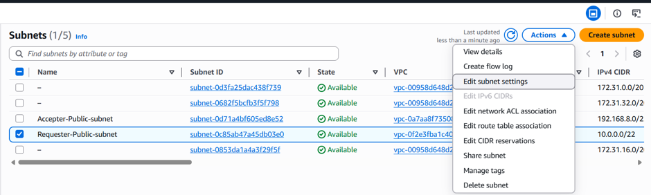
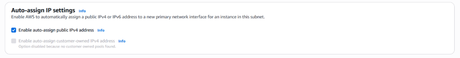
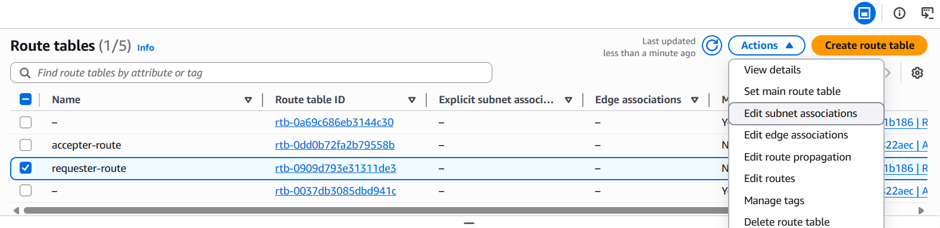
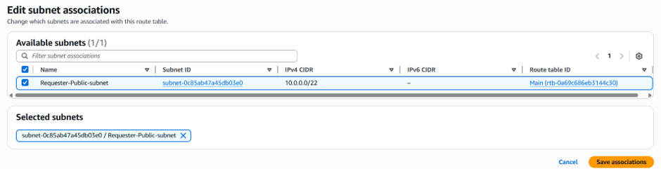
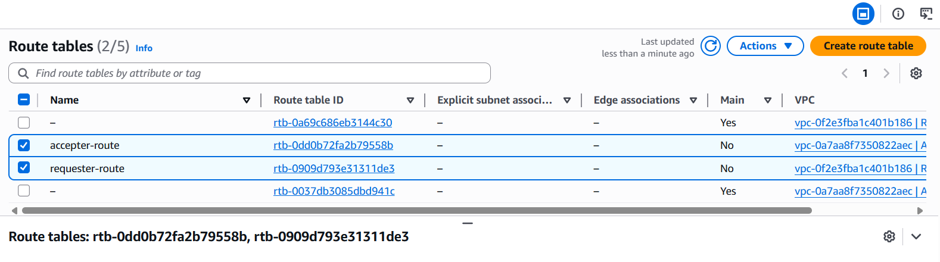
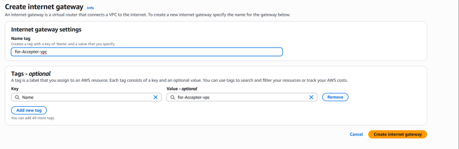
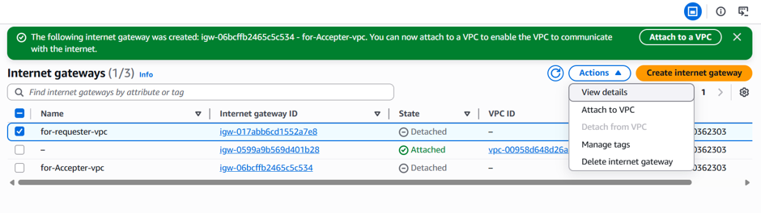
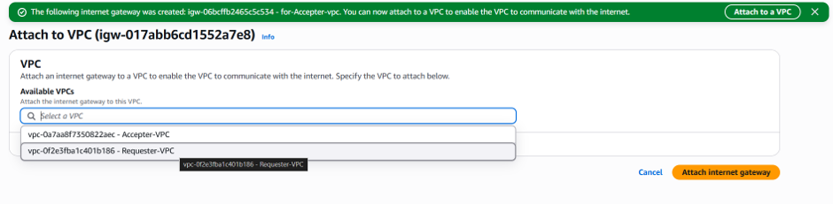
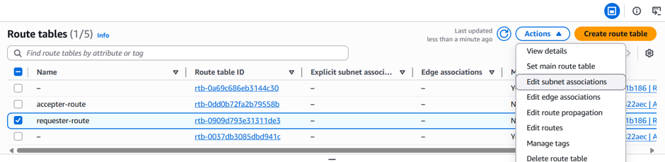
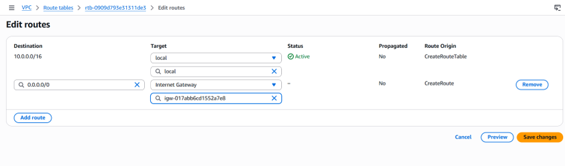

# 🚀 AWS VPC Peering Project

## 📖 Project Overview

This project demonstrates how to establish private communication between two Amazon Virtual Private Clouds (VPCs) using **AWS VPC Peering**.

The implementation includes:

- Creating two VPCs (Requester & Accepter)
- Creating Public Subnets
- Configuring Route Tables
- Attaching Internet Gateways
- Creating a VPC Peering Connection
- Launching EC2 Instances
- Verifying connectivity using private IP addresses

---

## 🛠 AWS Services Used

- Amazon VPC
- Amazon EC2
- Route Tables
- Internet Gateway
- VPC Peering
- Security Groups

---

## 📌 Project Objectives

- Build two isolated VPCs
- Configure networking resources
- Establish secure private communication
- Verify connectivity using ICMP (ping)

---

## 🏗 Architecture

                Internet
                    │
          ┌─────────┴─────────┐
          │                   │
      Internet Gateway    Internet Gateway
          │                   │
    Requester VPC        Accepter VPC
      10.0.0.0/16        192.168.0.0/16
          │                   │
     Public Subnet      Public Subnet
          │                   │
      EC2 Instance  ◄────VPC Peering────► EC2 Instance
---


## 🛠️ Implementation Steps

### Step 1: Create the Requester VPC

The first Virtual Private Cloud (VPC) was created as the **Requester VPC** with the required IPv4 CIDR block. This VPC initiates the VPC Peering request and serves as one side of the private network.


---

### Step 2: Create the Accepter VPC

Created the second Virtual Private Cloud (VPC) as the **Accepter VPC** with the CIDR block **192.168.0.0/16**. This VPC accepts the VPC Peering request and enables private communication with the Requester VPC.


---

### Step 3: Create Public Subnets on Both vpc

Created one public subnet in each VPC to host the EC2 instances. These subnets provide network connectivity within their respective VPCs and are configured to support communication through the VPC Peering connection.

**Subnet Details**

| VPC | Subnet Type | Purpose |
|-----|-------------|---------|
| Requester VPC | Public Subnet | Hosts the requester EC2 instance |
| Accepter VPC | Public Subnet | Hosts the accepter EC2 instance |


Repeat these steps for accepter vpc public subnet as well with the cidr block 192.168.8.0/22

---

---

### Step 4: Enable Auto-Assign Public IP

Enabled **Auto-assign Public IPv4 Address** for the public subnets in both VPCs. This ensures that any EC2 instance launched in these subnets automatically receives a public IP address, allowing secure internet access for administration and testing.




---

### Step 5: Create Route Tables

Created a dedicated Route Table for each VPC and associated it with the corresponding public subnet. Route tables determine how network traffic is directed within the VPC.

**Requester Route Table**
- Created a Route Table


- Associated it with the Requester Public Subnet
- 



**Accepter Route Table**
- Created another Route Table
- Associated it with the Accepter Public Subnet (Repeat steps same as requester for subnet association)



---

### Step 6: Create and Attach Internet Gateways

Created an Internet Gateway (IGW) for each VPC and attached it to the respective VPC. Internet Gateways enable communication between resources in the VPC and the internet.

**Requester Internet Gateway**

- Created an Internet Gateway



- Attached it to the Requester VPC





Updated the Requester Route Table by adding the following route:

| Destination | Target |
|-------------|--------|
| 0.0.0.0/0 | Internet Gateway |





**Accepter Internet Gateway** (follow same steps from requester igw)

- Created another Internet Gateway
- Attached it to the Accepter VPC

Updated the Accepter Route Table by adding the following route:

| Destination | Target |
|-------------|--------|
| 0.0.0.0/0 | Internet Gateway |

---

### Step 7: Create the VPC Peering Connection

Created a VPC Peering Connection to establish private communication between the Requester and Accepter VPCs.

Configuration:

- Requester VPC
- Accepter VPC
- Same AWS Account
- Same AWS Region


After creating the peering request, accepted the request from the Accepter VPC.


Once accepted, the VPC Peering Connection status changed to **Active**.


---

### Step 8: Update Route Tables for VPC Peering

To allow communication between both VPCs, updated the Route Tables by adding routes that point to the VPC Peering Connection.

**Requester Route Table**

| Destination | Target |
|-------------|--------|
| 192.168.0.0/16 | VPC Peering Connection |


**Accepter Route Table**

| Destination | Target |
|-------------|--------|
| 10.0.0.0/16 | VPC Peering Connection |


---

### Step 9: Launch EC2 Instances

Launched one EC2 instance in the Requester Public Subnet and another EC2 instance in the Accepter Public Subnet.

Both instances were configured with:

- Ubuntu
- Public IP Enabled
- Security Group allowing SSH (22)
- Security Group allowing ICMP (Ping)

**Requester EC2 Instance**


**Accepter EC2 Instance**


---

### Step 10: Verify VPC Peering Connectivity

Connected to both EC2 instances using SSH.

Verified connectivity by pinging the private IP address of each instance from the other instance.

From the **Requester EC2**

```bash
ping <Accepter-Private-IP>
```

Example:

```bash
ping 192.168.8.25
```


From the **Accepter EC2**

```bash
ping <Requester-Private-IP>
```

Example:

```bash
ping 10.0.1.84
```


Successful ping responses confirmed that the VPC Peering Connection was configured correctly and private communication between both VPCs was established.

---

## 🎯 Learning Outcomes

Through this project, I gained hands-on experience with:

- Amazon VPC Networking
- CIDR Block Planning
- Public Subnets
- Route Tables
- Internet Gateway (IGW)
- Security Groups
- EC2 Networking
- VPC Peering
- Private IP Communication
- AWS Networking Fundamentals

---

## ✅ Project Outcome

Successfully created two isolated Amazon VPCs and established secure private communication between them using AWS VPC Peering. Configured subnets, route tables, internet gateways, and EC2 instances, then verified connectivity using private IP addresses through ICMP (ping). This project demonstrates a practical understanding of AWS networking concepts and inter-VPC communication.

---

## 👩‍💻 Author

**Shivani Pawar**

**DevOps Engineer | AWS | Docker | Kubernetes | Terraform | Jenkins | Linux**

- GitHub: https://github.com/Shivani-Pawar-01
- LinkedIn: https://www.linkedin.com/in/shivani-pawar123

---

⭐ **If you found this project helpful, consider giving it a Star!**

