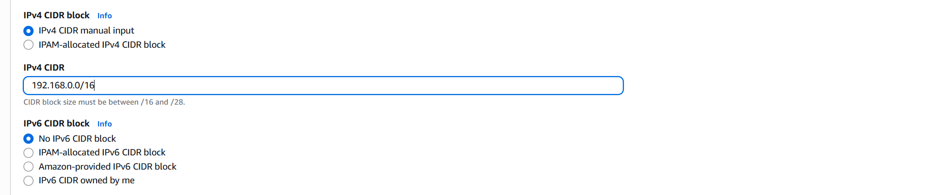
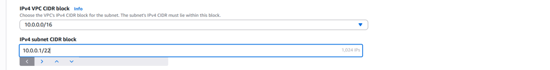

# 🚀 AWS VPC Peering Project

## 📖 Project Overview

This project demonstrates how to establish private communication between two Amazon Virtual Private Clouds (VPCs) using **AWS VPC Peering**.

The implementation includes:

- Creating two VPCs (Requester & Accepter)
- Creating Public Subnets
- Configuring Route Tables
- Attaching Internet Gateways
- Creating a VPC Peering Connection
- Launching EC2 Instances
- Verifying connectivity using private IP addresses

---

## 🛠 AWS Services Used

- Amazon VPC
- Amazon EC2
- Route Tables
- Internet Gateway
- VPC Peering
- Security Groups

---

## 📌 Project Objectives

- Build two isolated VPCs
- Configure networking resources
- Establish secure private communication
- Verify connectivity using ICMP (ping)

---

## 🏗 Architecture

                Internet
                    │
          ┌─────────┴─────────┐
          │                   │
      Internet Gateway    Internet Gateway
          │                   │
    Requester VPC        Accepter VPC
      10.0.0.0/16        192.168.0.0/16
          │                   │
     Public Subnet      Public Subnet
          │                   │
      EC2 Instance  ◄────VPC Peering────► EC2 Instance
---

## 🛠️ Implementation Steps

### Step 1: Create the Requester VPC

The first Virtual Private Cloud (VPC) was created as the **Requester VPC** with the required IPv4 CIDR block. This VPC initiates the VPC Peering request and serves as one side of the private network.

---

### Step 2: Create the Accepter VPC

Created the second Virtual Private Cloud (VPC) as the **Accepter VPC** with the CIDR block **192.168.0.0/16**. This VPC accepts the VPC Peering request and enables private communication with the Requester VPC.

---

### Step 3: Create Public Subnets on Both vpc

Created one public subnet in each VPC to host the EC2 instances. These subnets provide network connectivity within their respective VPCs and are configured to support communication through the VPC Peering connection.

**Subnet Details**

| VPC | Subnet Type | Purpose |
|-----|-------------|---------|
| Requester VPC | Public Subnet | Hosts the requester EC2 instance |
| Accepter VPC | Public Subnet | Hosts the accepter EC2 instance |

Repeat these steps for accepter vpc public subnet as well with the cidr block 192.168.8.0/22

---

## ✅ Result

Successfully established communication between EC2 instances deployed in different VPCs using AWS VPC Peering.